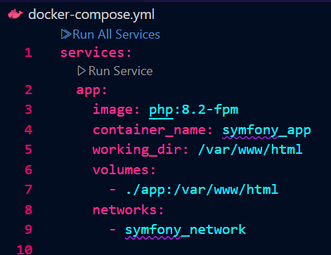

# UNIT SYMFONY

## VERIFIER LES VERSIONS

---

## EXPLICATION DES LIGNES DE DOCKER-COMPOSE.YML

On a la création de l'image avec son container.
Le working dir définit le répertoire de travail dans le conteneur.
Networks Associe le conteneur au réseau.
Ports définit le numéro du port.

---

## NGINX

écoute sur le port 80 et redirige les requêtes PHP vers PHP-FPM. 

# terminal Symfony

# capture d'écran SYMFONY 

